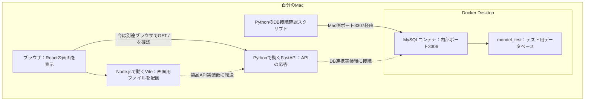

# Mondel — ML Experiment Evolution Manager

MLflowに記録されたRunを改善工程（Evolution Step）へ紐付け、実験の比較・系譜を確認する学習プロジェクトです。

## 最初に：何を作り、どこまで動かすのか

この手順のゴールは、Macで画面・APIの起動とテスト用DBへの接続を確認し、翌日も同じ手順で再開できる状態にすることです。製品全体は開発中です。

> 用語：フロントエンドは利用者に見える画面、バックエンドは画面からの依頼を処理する側、APIはプログラム同士が依頼・応答をやり取りする窓口です。

### 完成する開発環境の配置



実線はこの手順で確認する経路、点線は後続の開発でつなぐ経路です。現在の画面表示だけではFastAPIやMySQLとの連携まで成功したことにはなりません。

> 用語：MySQLはDBを管理するソフトウェア（DBMS）、DBは保存データの集まりです。今回のMySQLの中に`mondel_test`というDBを作ります。DockerはMySQLを隔離された実行場所「コンテナ」で動かします。

### この順番で進めます

| 工程 | やること | 終わった時に手元にあるもの |
|---|---|---|
| 前準備A | Macへツールを導入 | コマンドを実行できる環境 |
| 前準備B | リポジトリを取得してVS Codeで開く | 設定・コード・手順書の一式 |
| 0〜1 | 操作場所とツールの動作を確認 | 迷わず入力できるターミナル |
| 2 | プロジェクトの依存関係を導入 | Python・JavaScriptの必要なライブラリ |
| 3 | 接続設定を読む | どこへ接続するかの理解 |
| 4〜5 | MySQLを起動しPythonから接続 | SQLに応答できるテストDB |
| 6 | FastAPIとViteを起動 | ブラウザで確認できる応答・画面 |
| 7 | テストとビルド | 正常に動く範囲の確認結果 |
| 8 | 停止・再開方法を確認 | 翌日も再開できる状態 |

初回は前準備Aから読みます。導入済みなら前準備Aの確認だけ行い、取得済みなら前準備Bの再取得は省略します。日々の再開は工程8を参照してください。

### 現在の実装範囲

Setup段階ではReactの見出し表示、FastAPIの`GET /`、テスト専用MySQL、バックエンド・フロントエンドのsmoke testを用意しています。製品API（`/api/v1`）、DBテーブル・マイグレーション、MLflow連携は後続タスクで実装します。

設計は[Specification](specs/001-experiment-evolution/spec.md)、[Plan](specs/001-experiment-evolution/plan.md)、進捗は[Tasks](specs/001-experiment-evolution/tasks.md)を参照してください。[Quickstart](specs/001-experiment-evolution/quickstart.md)は完成後に向けた検証シナリオを含みます。現段階の起動手順は以下です。

## 前準備A. Macにツールを導入する

対象はmacOSの標準シェルzshです。ネット接続と、GitHub上のこのリポジトリを閲覧できるアカウントを用意してください。以下のインストール方法は2026-09-08に公式案内を確認しています。会社管理のMacでは会社指定の配布・利用条件にも従ってください。

> 用語：ターミナルは文字で命令を入力するアプリ、シェルはその命令を解釈するプログラムです。以下のbashブロックはzshでも使えるコマンドで、1行ずつ貼り付けてEnterを押します。ファイルへ書くコード例とは区別して説明します。

### A-1. ターミナルとGitを用意する

操作場所：Macで`Command+Space`を押して「ターミナル」を検索し、アプリを開きます。まだプロジェクトは不要なので、現在のディレクトリは問いません。

```bash
git --version
```

`git`はコードの変更履歴を管理する道具、`--version`は版を表示するオプションです。版が表示されたら導入済みです。Command Line Toolsのインストール画面が出たら案内に従います。未導入で案内も出ない場合は次を入力し、表示されたインストーラーを完了させてから上の確認を繰り返します。

```bash
xcode-select --install
```

`xcode-select`はAppleの開発ツールを管理する命令、`--install`は導入画面を開く指定です。成功条件は`git --version`で版が表示されることです。

### A-2. VS Codeを導入する

操作場所：ブラウザで[VS CodeのMac導入案内](https://code.visualstudio.com/docs/setup/mac)を開き、Mac用をダウンロードします。ダウンロードしたファイルを展開し、Visual Studio Codeを「アプリケーション」へ移動して起動します。

成功条件：VS Codeのウィンドウが開くこと。VS Codeはコードを読む・編集するエディタで、後ほどその中のターミナルへ操作場所を移します。

### A-3. uvとPythonを導入する

操作場所：A-1で開いたMacのターミナル、任意のディレクトリ。まず`uv --version`を入力し、版が出ればuvのインストール行を省略します。見つからなければ次を入力します。

```bash
curl -LsSf https://astral.sh/uv/install.sh | sh
```

| 部分 | 文法上の役割と意味 |
|---|---|
| `curl` | URLから内容を取得するコマンド |
| `-L` | 転送先URLがあれば追う |
| `-s` | 進捗表示を抑える |
| `-S` | エラーは表示する |
| `-f` | HTTPエラーを失敗として扱う |
| `https://astral.sh/uv/install.sh` | 取得する公式インストールスクリプトのURL |
| `\|` | 左の出力を右の入力へ渡すパイプ |
| `sh` | 受け取ったインストールスクリプトを実行するプログラム |

これは公式サイトのスクリプトをダウンロードして実行する操作です。完了後、ターミナルを閉じて開き直し、次を入力します。

```bash
uv --version
uv python install 3.12
```

`uv python install`はPython本体を導入する命令、`3.12`は選ぶ版です。uvはPython本体とPythonライブラリを管理する道具で、FastAPIを実行するのはPythonです。

成功条件：uvの版が表示され、Pythonの導入または導入済みの案内で正常終了すること。参考：[uv公式の導入手順](https://docs.astral.sh/uv/getting-started/installation/)。

### A-4. nvmからNode.js・npmを導入する

操作場所：Macのターミナル、任意のディレクトリ。`command -v nvm`で`nvm`と表示される場合はインストール行を省略します。見つからない場合は[公式nvm README](https://github.com/nvm-sh/nvm#installing-and-updating)の「Install & Update Script」にあるcurlコマンドをコピーし、このターミナルへ貼って実行します。インストール用の版付きURLは公式案内のものを使います。

> 用語：nvmはNode.jsの版を切り替える道具、Node.jsはブラウザ外でJavaScriptを実行する環境、npmはJavaScriptパッケージの導入・実行を管理する道具です。ViteやVitestはNode.js上で動きます。

公式コマンドの`curl`はスクリプトの取得、`-o-`は取得内容をファイルではなく標準出力へ出す指定、URLは取得元、`| bash`は取得した内容をbashで実行する指定です。インストーラーは通常`.zshrc`へnvm読み込み設定を追加します。

インストールが完了したら、同じターミナルに入力します。

```bash
source "$HOME/.nvm/nvm.sh"
nvm install 24
nvm use 24
node --version
npm --version
```

| 部分 | 意味 |
|---|---|
| `source` | ファイルの設定・関数を今のシェルへ読み込む |
| `$HOME` | 自分のホームディレクトリを表す変数 |
| `"..."` | パスを1つの引数として扱うための引用符 |
| `.nvm/nvm.sh` | nvmを使えるようにするスクリプト |
| `nvm install 24` | Node.js 24系を導入する。npmも付属する |
| `nvm use 24` | 今のターミナルでNode.js 24系を選ぶ |
| `node --version` / `npm --version` | 実際に選ばれた版を表示する |

成功条件：Node.jsが`v24...`、npmが`11...`であること。前者だけ合って後者が異なる場合は先へ進まず、`frontend/package.json`の対応範囲と照合します。

### A-5. Docker Desktopを導入する

操作場所：ブラウザとFinder。Appleメニューの「このMacについて」で、チップがApple silicon（Mシリーズ）かIntelか確認します。[Docker公式のMac導入ページ](https://docs.docker.com/desktop/setup/install/mac-install/)から対応するものをダウンロードし、`.dmg`を開いてDockerを「アプリケーション」へ移動します。Dockerを起動し、初回案内を完了します。

Macのターミナルを開き直して、入力します。

```bash
docker compose version
docker info
```

成功条件：Composeの版と、`docker info`のServer情報が表示されること。Docker DesktopにはComposeが含まれるため、別途Composeを導入する必要はありません。

> 用語：Dockerイメージは実行環境のひな形、コンテナはそのひな形から作って動かす実体、Composeは設定ファイルに従ってコンテナを起動・停止する道具です。MySQLをMacへ直接インストールする作業は不要で、工程4でDockerが取得・起動します。

これで「Mac全体で使う道具」が揃いました。次は、道具で動かすプロジェクトのファイルを取得します。

## 前準備B. プロジェクトを取得する

> 用語：リポジトリはコードと変更履歴をまとめた保管場所、cloneはそれを自分のMacへ取得する操作です。

取得済みならcloneを繰り返さず、VS Codeの「ファイル」→「フォルダーを開く」で既存のリポジトリを開き、工程0へ進みます。

未取得の場合の操作場所：Macのターミナル。以下はホーム内の`projects`へ取得する一つの手順です。

```bash
mkdir -p "$HOME/projects"
cd "$HOME/projects"
git clone https://github.com/Yukimatsu-S/sdd_react_fastapi_practice.git
cd sdd_react_fastapi_practice
pwd
```

`mkdir`はディレクトリ作成、`-p`は親も作り既存ならそのまま使う指定、`cd`は移動、`git clone`の後は取得元URLです。最後の`pwd`で取得した場所を確認します。認証が必要なら所属先で認められたGitHub認証方法を使います。同名フォルダが既にある場合は削除せず、取得済みか確認してください。

VS Codeの「ファイル」→「フォルダーを開く」で、今表示されたディレクトリを選びます。成功条件：ファイル一覧にREADME・backend・frontendが表示されること。

この手順は**開いている版のコード**を再現します。過去と厳密に同じ版を再現するには、その時のコミットIDが必要です。`git rev-parse HEAD`で現在のIDを表示し、検証記録に残してください。最新のmainにこのSetup用ファイルがまだない場合は、作業担当者から対象のブランチ／コミットを確認します。

> 用語：コミットIDは保存したコードの版を識別する値です。ロックファイルはライブラリの版を固定しますが、OSやすべてのツールの版まで固定するものではありません。

## 0. 操作する場所を決める

前準備で、リポジトリと次のツールを用意した状態から始めます。

- Python 3.12以上、uv
- Node.js 24系、npm 11系（`frontend/package.json`の`engines`に対応）
- Docker Compose対応のDocker環境。MacではDocker Desktopを起動しておく

1. VS Codeでこのリポジトリのフォルダを開きます。
2. メニューの「ターミナル」→「新しいターミナル」を選びます。これを以下では「ターミナルA」と呼びます。
3. 下のコマンドをターミナルAの入力欄へ1行ずつ貼り付け、各行でEnterを押します。READMEやPythonファイルへ書き込む操作ではありません。

```bash
pwd
ls
```

`pwd`は現在位置の表示、`ls`はその場所にあるファイルの一覧表示です。`README.md`、`backend`、`frontend`、`docker-compose.test.yml`が同じ一覧にあることを確認します。この場所を「リポジトリルート」と呼びます。違う場所なら、このリポジトリのフォルダをVS Codeで開き直してターミナルを作り直してください。

**以降のbashブロックはすべて、指定されたターミナルへ1行ずつ入力するコマンドです。Pythonスクリプトは作成済みのファイルをコマンドから呼びます。エラーが出たら、その手順で止まって原因を確認します。**

## 1. ツールが使えるか確認する

操作場所：ターミナルA、リポジトリルート。Macのアプリ一覧からDocker Desktopを開き、起動が完了してから入力します。

```bash
uv --version
node --version
npm --version
docker compose version
docker info
```

`--version`と`version`は各ツールの版を表示する指定です。Node.jsが`v24...`、npmが`11...`であることを確認します。`docker info`はDocker本体との通信確認で、ClientだけでなくServerの情報も表示されれば成功です。

nvmを導入済みで`node`や`npm`が見つからない場合は、ターミナルAへ次を入力し、上の確認を再実行します。

```bash
source "$HOME/.nvm/nvm.sh"
nvm use 24
```

`source`は指定したシェルスクリプトを現在のターミナルへ読み込む命令、`$HOME`は自分のホームディレクトリ、`nvm use 24`はこのターミナルでNode.js 24系を使う指定です。nvm未導入やNode.js 24未インストールなら、その前提環境を整えてから戻ります。

## 2. 依存関係をインストールする

操作場所：ターミナルA、リポジトリルート。上から順に入力します。

```bash
cd backend
uv sync --locked --all-groups
cd ../frontend
npm ci
cd ..
```

uvは`pyproject.toml`と`uv.lock`から`backend/.venv`を準備します。`--locked`はロックファイルとの不整合時に停止し、`--all-groups`はpytest・Ruffなどの開発用依存も含めます。

> 用語：依存関係はコードが利用する外部ライブラリのこと、パッケージは配布・導入する単位です。`.venv`はこのプロジェクト専用のPython環境で、他のプロジェクトのライブラリと分離します。`node_modules`はnpmがライブラリを置くディレクトリです。

`npm ci`は`package-lock.json`に固定された依存関係を`frontend/node_modules`へ再インストールします。既存の`node_modules`は置き換わります。

| 部分 | 意味 |
|---|---|
| `cd backend` | 現在位置からbackendへ移動する |
| `uv sync` | Pythonの依存関係を同期する命令 |
| `--locked` | ロックファイルの更新が必要ならエラーにするオプション |
| `--all-groups` | 開発用を含むすべての依存グループを選ぶオプション |
| `../frontend` | `..`で親へ戻り、frontendへ入る相対パス |
| `npm ci` | ロックファイルどおりにNode.js用パッケージを導入する命令 |
| `cd ..` | 親のリポジトリルートへ戻る |

成功条件：両方のインストールがエラーなく終了し、`backend/.venv`と`frontend/node_modules`が作られること。最後の行でターミナルAはリポジトリルートへ戻ります。

## 3. 設定ファイルの役割を確認する

操作場所：VS Codeのファイル一覧から`backend/.env.example`を開いて読みます。今回のSetupではこのファイルを変更する必要はありません。接続確認スクリプトも、この共有例のテストDB URLを読みます。

> 用語：環境変数はプログラムへ外から渡す名前付き設定値です。`.env.example`はその記入例で、ファイルを置くだけではOSの環境変数になりません。読み取る処理が必要です。

現在は`.env`の読み込みが未実装なので、以下のコピーは後続の設定実装時に行う参考手順です。今は実行せず、手順4へ進みます。必要になった時はターミナルAのリポジトリルートで入力します。

```bash
cp -n backend/.env.example backend/.env
```

`cp`はコピー命令、`-n`は既存ファイルを上書きしない指定、次の2つのパスは順にコピー元・コピー先です。

| 設定名 | 用途 | 現在の接続例 |
|---|---|---|
| `MONDEL_DATABASE_URL` | 通常利用するDB | `127.0.0.1:3306/mondel`。ユーザー名・パスワードは要設定 |
| `MONDEL_TEST_DATABASE_URL` | テスト専用DB | `127.0.0.1:3307/mondel_test`。下記Composeと対応 |
| `MLFLOW_TRACKING_URI` | 外部MLflow Tracking Server | `http://127.0.0.1:5000` |

`.env`はGit管理対象外です。テスト用Composeの固定認証値はローカルテスト専用で、通常環境に流用しません。

現在の`backend/main.py`はこれらの設定を読み込まず、DB・MLflowへ接続しません。設定読み込みと検証はT008・T009、DBテストでの接続先選択はT010以降で実装します。通常DBとMLflowの構築はこのSetup手順に含みません。

## 4. テスト専用MySQLを起動する

操作場所：ターミナルA、リポジトリルート。

```bash
docker compose -f docker-compose.test.yml up -d --wait --wait-timeout 180
docker compose -f docker-compose.test.yml ps
```

| 部分 | 意味 |
|---|---|
| `docker compose` | Compose設定でサービスを管理する命令 |
| `-f docker-compose.test.yml` | 読み込む設定ファイルを指定する |
| `up` | 必要なコンテナなどを作り、起動する |
| `-d` | バックグラウンドで動かす |
| `--wait` | 起動・health checkの成功を待つ |
| `--wait-timeout 180` | 待ち時間の上限を180秒にする |
| `ps` | このComposeが管理するコンテナの状態を表示する |

MySQL 8.0.46が起動し、`mysql-test`が`healthy`になることを確認します。初回はイメージのダウンロードとDB初期化に時間がかかります。health checkはテストユーザーで`mondel_test`へ接続し、`SELECT 1`を実行します。

> 用語：ポートは通信を受け取る入口の番号、`127.0.0.1`は接続する側から見た自分自身です。health checkはサービスが処理できるか定期確認する仕組み、SQLはDBへ検索・登録などを依頼する言語です。

```text
Mac上のPython → 127.0.0.1:3307 → Dockerのポート転送 → MySQLコンテナ:3306
```

## 5. MacのPythonからMySQLへ接続する

操作場所：ターミナルA、リポジトリルート。Pythonコードをターミナルへ長文で貼る必要はありません。[作成済みスクリプト](backend/scripts/check_test_database.py)を次のコマンドで実行します。

```bash
cd backend
uv run python scripts/check_test_database.py
cd ..
```

`uv run`はプロジェクトのPython環境で後続の命令を実行する指定です。`python`が実行プログラム、`scripts/check_test_database.py`が読み込むファイルです。最後にリポジトリルートへ戻ります。

成功時は`PASS: (1, 'mondel_test', '8.0.46')`を表示します。失敗時は例外を表示して終了するので、次の手順へ進む前に内容を確認します。

スクリプトをVS Codeで開くと、次の順序で処理を追えます。

1. `if __name__ == "__main__"`：このファイルを直接実行した時に`main()`を呼ぶ。
2. `main()`から`read_test_database_url()`を呼ぶ。
3. `.env.example`を1行ずつ読み、`MONDEL_TEST_DATABASE_URL`の値だけを文字列で返す。
4. `make_url()`が文字列をhost・port・databaseなどに分解する。ここでは接続しない。
5. 接続先が`127.0.0.1:3307/mondel_test`であることを確認する。
6. `pymysql.connect()`が接続し、`connection`を返す。
7. `connection.cursor()`がSQLの送受信用オブジェクトを作り、`cursor.execute()`がSQLを送る。
8. `cursor.fetchone()`が結果1行を`(1, "mondel_test", "8.0.46")`として受け取る。
9. 期待値と比較し、成功を表示する。カーソルは`with`終了時、接続は`finally`で閉じる。途中で失敗しても終了処理を行う。

SQLの`SELECT`は値を取得する命令、`1`は固定値、`DATABASE()`は接続中のDB名、`VERSION()`はMySQLの版を返す関数です。この確認ではデータを書き込みません。

## 6. 開発サーバーを起動する

ここではMySQLは起動したままにします。ターミナルAは検証用として残し、VS Codeのターミナル欄の「＋」から新しいターミナルを2つ作ります。バックエンド用をB、フロントエンド用をCと呼びます。各ターミナルで`pwd`と`ls`を入力し、手順0と同じリポジトリルートであることを確認してください。

### 6-1. バックエンド：ターミナルB

リポジトリルートから入力します。

```bash
cd backend
uv run fastapi dev main.py --host 127.0.0.1 --port 8000
```

`uv run`はPython環境の選択、`fastapi`は実行するCLI、`dev`は開発用起動、`main.py`は読み込むファイル、`--host`は待ち受けるアドレス、`--port`は待ち受けるポートの指定です。このコマンドは終了せず動き続けます。以後、ターミナルBへ別のコマンドを入力しません。

`main.py`の`app`が読み込まれます。`http://127.0.0.1:8000/`を開くと`root()`が呼ばれ、`{"message":"Hello World"}`が返ります。APIドキュメントは`http://127.0.0.1:8000/docs`です。

確認する場所：ブラウザのアドレスバーへ上のURLを入力します。JSONが表示されれば成功です。

### 6-2. フロントエンド：ターミナルC

リポジトリルートから入力します。新しいターミナルでnpmが見つからない場合は、手順1のnvm読み込みをターミナルCでも行います。

```bash
cd frontend
npm run dev
```

`npm`はパッケージ管理ツール、`run`は`package.json`のscriptsを実行する命令、`dev`はscripts内の名前です。現在の値は`vite`なので、Node.js上でVite開発サーバーが起動します。このターミナルも起動したままにします。

Viteが表示したLocal URL（通常`http://localhost:5173/`）を開き、`Mondel`と`ML Experiment Evolution Manager`を確認します。`index.html` → `src/main.tsx` → `src/App.tsx` → ReactによるDOM描画の順に表示されます。各サーバーは起動したターミナルで`Ctrl+C`を押して終了します。

> 用語：Reactは画面を組み立てるライブラリ、Viteは開発時の配信とビルドを担う道具です。TSXはTypeScript内に画面の構造を書ける形式、DOM（Document Object Model）はブラウザが操作・表示するページの木構造です。Viteがコードを変換・配信し、ブラウザ上のReactがDOMを更新します。

### API通信の経路

ここは仕組みを読むための説明です。以下のJavaScriptはターミナルへ入力しません。製品APIと呼び出し処理は後続タスクで実装するため、現段階では画面からこの通信は発生しません。

#### URLの「住所」と「窓口」を分ける

例として、ブラウザで`http://localhost:5173/`の画面を開いているとします。将来その画面が一覧を取得するときのURLは次の形です。

```text
http://localhost:5173/api/v1/evolution-steps
└─────────┬────────┘└──────────┬─────────┘
        origin               パス
```

| 部分 | 意味 | 今回の具体例 |
|---|---|---|
| `http` | scheme（通信方式） | HTTPで通信する |
| `localhost` | ホスト名（接続先） | 自分のPCを指す名前 |
| `5173` | ポート（入口の番号） | Viteが待ち受ける入口 |
| `/api/v1/evolution-steps` | パス（サーバー内の窓口） | 製品APIのEvolution Step用の窓口 |

**originは通信方式・ホスト・ポートをひと組にしたもの**です。この例では`http://localhost:5173`が1つのoriginです。パスはoriginに含みません。

| 比較する2つのURL | 同じoriginか | 理由 |
|---|---|---|
| `http://localhost:5173/`と`http://localhost:5173/api/v1/evolution-steps` | 同じ | パスだけが違う |
| `http://localhost:5173/`と`http://localhost:8000/` | 違う | ポートが違う |
| `http://localhost:5173/`と`http://127.0.0.1:5173/` | 違う | ホストの表記が違う。どちらも自分のPCでも別扱い |
| `http://localhost:5173/`と`https://localhost:5173/` | 違う | 通信方式が違う |

> 用語：origin（オリジン）はブラウザが通信先の境界を判断する単位です。同じPC上で動いているというだけでは、同じoriginにはなりません。

#### /apiとGET・POSTは別の情報

HTTPリクエストは「メソッド」と「URL」を組み合わせて送ります。

```text
GET  /api/v1/evolution-steps  → 一覧を取得する窓口
POST /api/v1/evolution-steps  → 新しく登録する窓口
```

`GET`・`POST`は**メソッド**で、行う操作の種類を表します。`/api`は**パスの先頭部分**で、API用の窓口であることを示す、このアプリの命名ルールです。`/v1`はAPIの版、`/evolution-steps`は対象を表します。同じパスでもメソッドによって処理を分けられます。

FastAPI側はメソッドとパスを見て対応する関数を選びます。パスを`/api`から始めるだけでAPIや関数が自動生成されるわけではありません。

> 用語：リクエストは処理の依頼、レスポンスはその応答です。GETで一覧を依頼すると、サーバーが一覧のデータをレスポンスとして返す、という関係です。

#### fetchはブラウザから依頼を送る関数

将来のフロントエンドコードの例です。

```javascript
const response = await fetch("/api/v1/evolution-steps");
const data = await response.json();
```

| 部分 | 文法・役割 |
|---|---|
| `const response = ...` | 右側の結果をresponseという名前で受け取る |
| `fetch(...)` | URLへHTTPリクエストを送る、ブラウザが提供する関数 |
| `"/api/v1/evolution-steps"` | 接続先のパスを表す文字列。メソッド省略時はGET |
| `await` | 非同期処理の結果を待ってから、この関数内の次の行へ進む。ブラウザ全体を停止する指定ではない |
| `response` | HTTPステータス・ヘッダー・本文などを扱うResponseオブジェクト |
| `response.json()` | 応答本文をJSONとして読み、JavaScriptのデータへ変換する |
| `data` | 変換後のオブジェクトや配列を受け取る名前 |

`await`を関数内で使う場合、その関数は`async`で定義します。これはブラウザ側のJavaScriptの話で、Pythonバックエンドの同期処理方針とは別です。実装時にはHTTPステータスを確認し、エラー応答も扱います。上の例は正常時の流れを説明するための抜粋です。

`/`から始まりホストを省略した相対URLなので、今回のページでは次の接続先になります（通常のdocument base URLを使用する現在の構成）。

```text
開いているページ：http://localhost:5173/
fetchへ渡す値   ：/api/v1/evolution-steps
実際の送信先    ：http://localhost:5173/api/v1/evolution-steps
```

> 用語：JSONは`{"message":"Hello World"}`のようにデータを表すテキスト形式です。`response.json()`で読み取ると、JavaScriptからプロパティを取り出せるデータになります。

#### Viteは依頼をFastAPIへ中継する

ブラウザがまず接続するのは5173番のViteです。Viteには`frontend/vite.config.ts`で次の設定があります。

```typescript
server: {
  proxy: {
    "/api": "http://127.0.0.1:8000",
  },
},
```

`server`は開発サーバーの設定、`proxy`は中継先の設定です。`"/api"`は照合するパスの先頭、右側のURLは転送先です。Viteは`/api`から始まるパスへのリクエストを受け取ると、その依頼をFastAPIへ送ります。これを「APIを転送する」と省略していましたが、正確には**API宛てのHTTPリクエストを中継する**という意味です。

```text
1. ブラウザからViteへ
   GET http://localhost:5173/api/v1/evolution-steps

2. ViteからFastAPIへ
   GET http://127.0.0.1:8000/api/v1/evolution-steps

3. FastAPIがGETとパスに対応する処理を実行
   → 応答がFastAPI → Vite → ブラウザの順に戻る

4. ブラウザのfetchがResponseを返し、response.json()で本文を読む
```

変わるのはViteが接続する相手のホスト・ポートです。この設定ではパスの`/api`を削る書き換えを指定していないため、FastAPIにも`/api/v1/...`が届きます。POSTの場合もPOSTのまま、登録内容を入れた本文とともに中継します。

> 用語：proxy（プロキシ）は通信を中継する役割です。ここではViteがブラウザの依頼を受け、FastAPIから受け取った応答をブラウザへ返します。

#### なぜこの経路にするのか

ブラウザから見た「画面の取得先」と「APIの依頼先」が両方`http://localhost:5173`となり、同じoriginで通信できます。ブラウザから8000番のFastAPIへ直接fetchすると別originになるため、サーバー側でその通信を許可するCORS設定などが必要になります。

> 用語：CORS（Cross-Origin Resource Sharing）は、別originのページからのアクセスをブラウザに許可するための仕組みです。通常のブラウザ上のfetchで応答を利用する際に関係します。

ローカルMVPはVite経由で同じoriginへ送る設計なので、FastAPIへCORS設定を追加しません。ViteからFastAPIへの中継はブラウザ内の通信処理ではありません。

現在は製品APIが未実装なので、このパスを呼ぶとFastAPIは404（該当する窓口がない）を返します。機能検証は後続タスクで行います。また、Viteの開発用proxyは`dist/`に含まれないため、本番公開時の中継方法は別途必要です。

## 7. テストとビルドを確認する

操作場所：ターミナルA、リポジトリルート。B・Cは動かしたまま、Aへ次を1行ずつ入力します。

```bash
cd backend
uv run pytest tests/unit/test_test_environment.py
uv run ruff check tests/unit/test_test_environment.py
cd ../frontend
npm test -- --run src/test/setup.test.tsx
npm run build
cd ..
```

| コマンド | 処理と確認範囲 |
|---|---|
| pytest | `pytest.ini`を読み、`.env.example`の通常DB・テストDBのURL記載を検証。実際の環境変数選択やDB接続は検証しない |
| Ruff | Pythonテストの静的検査 |
| Vitest | `vitest.config.ts` → jsdom → `src/test/setup.ts` → `setup.test.tsx` → App描画と文字確認。終了後にcleanup |
| build | `tsc --noEmit`の型検査 → `vite build` → `dist/`へブラウザ配信用ファイルを生成 |

`npm test`は`package.json`の`"test": "vitest"`を実行し、`--`より後の引数をVitestへ渡します。`--run`は変更監視をせず1回で終了する指定です。

`pytest`の後のパスは実行するテストファイルです。`ruff check`は静的検査の命令で、その後のパスが検査対象です。`npm run build`の`build`もscripts内の名前で、現在は`tsc --noEmit && vite build`を実行します。`tsc`はTypeScriptの検査、`--noEmit`はファイルを生成しない指定、`&&`は左の成功時だけ右へ進む記号です。`vite build`が配信用ファイルを生成します。

成功条件：pytestが`1 passed`、Ruffが`All checks passed!`、Vitestが`Tests 1 passed`、ビルドが`built`を表示すること。最後の`cd ..`でターミナルAはリポジトリルートへ戻ります。

現在のsmoke testはバックエンド・フロントエンド各1件です。ブラウザの実表示、DB接続、ビルド成功はそれぞれ別の確認です。ビルド成功は公開完了や製品機能の動作保証を意味しません。生成した`dist/`はGit管理対象外です。

> 用語：smoke testは基本動作の短い確認、jsdomはNode.js上でDOMを再現するライブラリです。Vitestはテストを進行し、React Testing Libraryは描画・検索を補助します。ビルドはソースを配布可能なファイルへ変換・整理する工程、デプロイはそれを配信先へ配置する工程です。

## 8. 作業を終了する／翌日再開する

1. ターミナルBで`Ctrl+C`を押し、FastAPIを終了します。
2. ターミナルCで`Ctrl+C`を押し、Viteを終了します。
3. ターミナルAのリポジトリルートで、次を入力します。

```bash
docker compose -f docker-compose.test.yml stop
docker compose -f docker-compose.test.yml ps -a
```

`stop`はコンテナを残して停止する命令です。`ps -a`の`-a`は停止済みも含める指定で、`mysql-test`が`Exited`になれば停止完了です。

翌日はDocker Desktopを起動し、手順0で新しいターミナルAの場所を確認してから、手順4〜7を行います。依存関係の更新や新しいチェックアウトがある場合は手順2も行います。

### なぜ日常の終了はdownではなくstopなのか

| 操作 | コンテナ | Composeのネットワーク | 再開時 |
|---|---|---|---|
| `stop` | 残して停止 | 残る | 既存コンテナを再開できる |
| `down` | 停止して削除 | 削除 | 次のupでコンテナを作り直す |

日常の終了では同じテストDBを再利用するため`stop`を使います。環境を片付けて再構築する用途では`down`を使います。

現在のComposeはDB保存先の名前付きvolumeを明示していません。`down`は通常volumeを削除しませんが、匿名volumeは次の`up`で自動再利用されません。そのため「downしてupすれば元のDBに戻る」とは扱えません。`down -v`はvolumeも削除するので、この通常手順では実行しません。長期データ保存を伴う運用の設計は別途必要です。

根拠：[Docker Compose stop](https://docs.docker.com/reference/cli/docker/compose/stop/)、[Docker Compose down](https://docs.docker.com/reference/cli/docker/compose/down/)。

## よくあるつまずき

- Docker daemonへ接続できない：Docker Desktopの起動状態を`docker info`で確認する。
- `3307`が使用済み：既存のコンテナ・プロセスを確認する。ポートを変更する場合はCompose・接続URL・検証の期待値を揃える。
- `uv`や`npm`が見つからない：インストール状態と、そのターミナルのPATHを確認する。
- 初期化に失敗する：`docker compose -f docker-compose.test.yml logs mysql-test`で原因を確認する。

## 付録：ツールのつながりと以前の学習メモ

環境再現の操作は工程8までです。以下は読み物としての補足で、追加の実行作業はありません。Spec Kitは仕様・設計・Tasksを作るために使い、今回のアプリ起動にはCLIの導入を必要としません。

```txt
Mac本体
│
├─ Git                  ← OS側のツール
├─ Node.js / npm        ← JavaScript実行環境・パッケージ管理
├─ uv                   ← Python環境・パッケージ管理ツール
│   ├─ specify-cli      ← uv toolで独立してインストール
│   │   └─ specify コマンド
│   │
│   └─ backend/.venv    ← FastAPI用のPython環境
│       └─ FastAPI
│
└─ プロジェクト
    ├─ frontend/         ← React
    └─ backend/          ← FastAPI
```

**それぞれの依存関係の管理方法**

```txt
React → npm

FastAPI → uv

spec-kit CLI → uv tool

Git → OSレベル
```

**実際にインストールするものたちの概要**

| ツール         | 置き場所          | 用途           |
| ----------- | ------------- | ------------ |
| Git         | Mac側          | Git管理        |
| Node.js     | Mac側          | React/Vite実行 |
| npm         | Node.jsと一緒    | React依存管理    |
| uv          | ユーザー環境        | Python環境管理   |
| Python      | uvに管理させてもOK   | FastAPI実行    |
| specify-cli | `uv tool`     | Spec Kit CLI |
| FastAPI     | プロジェクト`.venv` | Backend      |


### メモ

- spec-kitというプロジェクトが提供しているCLIパッケージの名前がspecify-cli
- ReactとFastAPIで、依存関係の管理方法がそもそも違う
- uvはプロジェクトごとに.venvを作り、依存パッケージをそこへ隔離して管理できる、つまりわざわざ venv を作成しなくて済む
